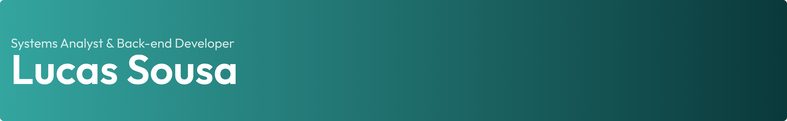

---

## 🌐 Connect with me

  &nbsp;&nbsp;
  &nbsp;&nbsp;
  

## 👨‍💻 About Me

Hey! I'm Lucas 👋  

I'm a developer focused on building **high-performance**, **scalable**, and **maintainable backend applications**.

💡 I enjoy transforming ideas into real-world solutions using clean architecture and best practices.

- 🔧 Experience in Systems Development  
- ⚙️ Strong focus on backend engineering  
- 📈 Always improving code quality and system design  

---

## 🚀 Tech Stack

### 🧠 Languages
- Golang
- TypeScript / JavaScript
- Java
- PHP

### ⚙️ Frameworks & Tools
- Laravel
- NestJS
- Spring Boot

### 🗄️ Databases
- PostgreSQL
- MySQL
- MongoDB
- SQLite

---

## 📚 Currently Learning

- Golang (advanced patterns & performance)
- PHP (Laravel ecosystem)
- Backend architecture & scalability

---

